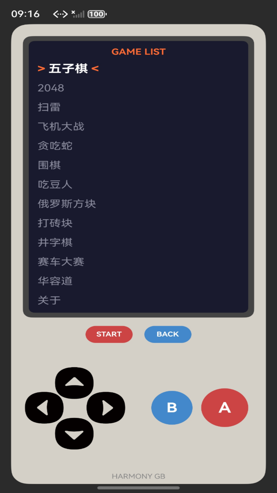
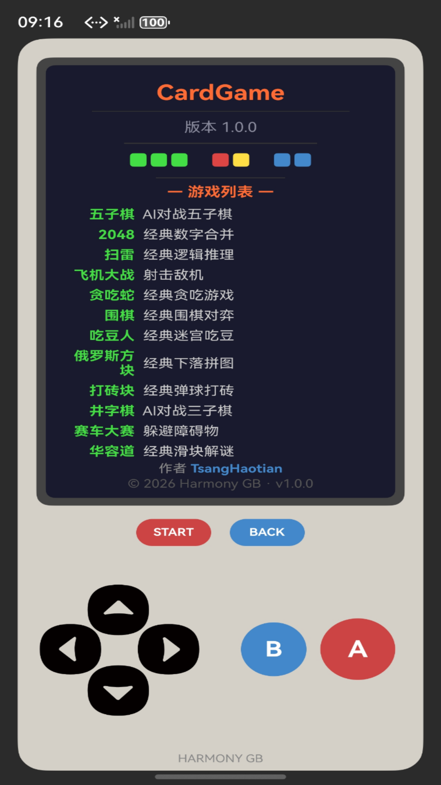
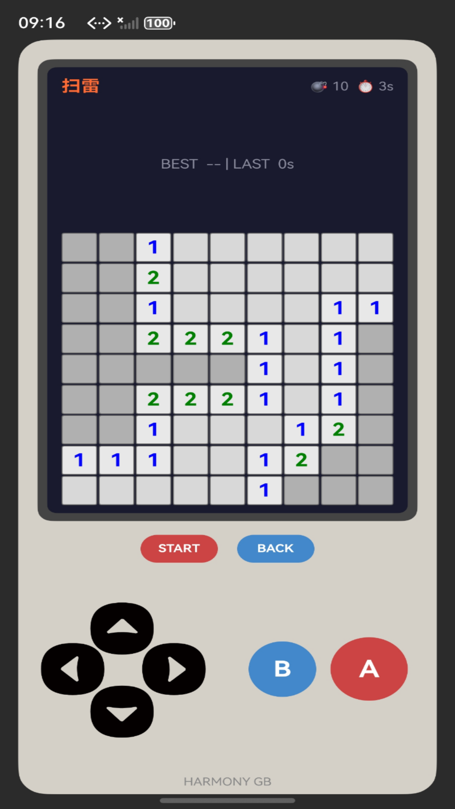
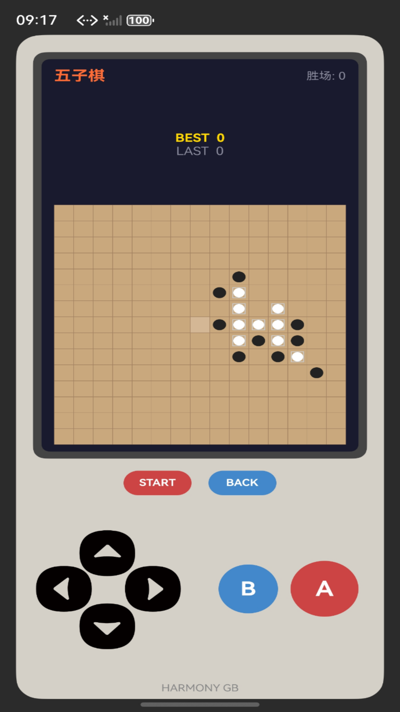

# CardGame

一款鸿蒙怀旧掌机风格的多功能娱乐应用，集成12款经典益智互动玩法。

## 截图

| 主菜单 | 游戏界面 |
|:-:|:-:|
|  |  |
| **游戏界面** | **游戏界面** |
|  |  |

## 功能

- 经典益智交互合集（12款）
- 复古 Game Boy 风格界面
- 十字键 + A/B 按键操控
- 支持手机、平板、电视等设备
- 每款独立计分，记录最佳成绩
- 按键音效与震动反馈

## 包含内容

- 2048、扫雷、贪吃蛇、俄罗斯方块、打砖块
- 五子棋、围棋、井字棋（AI交互）
- 吃豆人、赛车、飞机大战
- 华容道（关卡系统）

## 开发环境

- HarmonyOS SDK 6.0.2 (API 22)
- ArkUI + ArkTS

## 小记

本来准备上架华为应用市场的，结果个人开发者不能上架游戏类应用（需要版号），卡在最后一步放弃了，干脆开源出来。

所以如果你看到应用里还有隐私政策弹窗、应用截图什么的，那都是当时上架准备留下的痕迹 ¯\\_(ツ)_/¯
